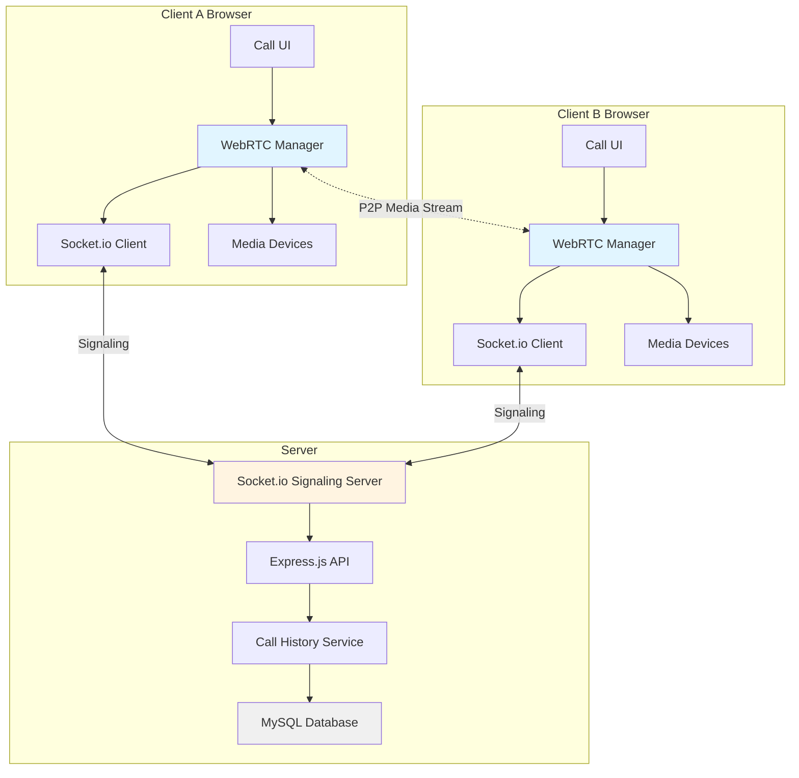

# Design Document: Audio-Video Calling Feature

## Overview

This design document specifies the technical architecture for implementing real-time audio and video calling capabilities in VitalMatch using WebRTC technology. The system enables peer-to-peer communication between users while integrating seamlessly with the existing Express.js messaging infrastructure.

### Core Technologies

- **WebRTC**: Peer-to-peer audio/video communication
- **Socket.io**: Real-time signaling server for WebRTC connection establishment
- **Express.js**: Backend API endpoints for call management
- **Sequelize ORM**: Database persistence for call history
- **Vanilla JavaScript**: Client-side call management and UI

### Design Principles

1. **Minimal Backend Load**: Use peer-to-peer connections to minimize server bandwidth
2. **Progressive Enhancement**: Gracefully degrade when WebRTC is unavailable
3. **Security First**: Authenticate all signaling messages and verify user permissions
4. **Integration**: Leverage existing authentication, messaging, and user systems
5. **Simplicity**: Keep the implementation straightforward and maintainable

## Architecture

### High-Level Architecture



### Communication Flow

1. **Call Initiation**: Caller clicks call button → Client requests media permissions → Socket.io sends offer to signaling server
2. **Signaling**: Server validates users → Forwards offer to callee → Callee receives notification
3. **Connection Establishment**: Callee accepts → Exchanges SDP and ICE candidates via signaling server → WebRTC peer connection established
4. **Active Call**: Direct peer-to-peer media streaming → Minimal server involvement
5. **Call Termination**: Either party ends call → Notify other party → Record call history → Release resources

### Component Layers

```
┌─────────────────────────────────────────────────────────┐
│                    Presentation Layer                    │
│  (Call UI, Controls, Notifications, Video Display)      │
└─────────────────────────────────────────────────────────┘
                          ↓
┌─────────────────────────────────────────────────────────┐
│                   Application Layer                      │
│  (Call State Machine, WebRTC Manager, Permission Handler)│
└─────────────────────────────────────────────────────────┘
                          ↓
┌─────────────────────────────────────────────────────────┐
│                  Communication Layer                     │
│     (Socket.io Client, Signaling Protocol Handler)      │
└─────────────────────────────────────────────────────────┘
                          ↓
┌─────────────────────────────────────────────────────────┐
│                      Server Layer                        │
│  (Socket.io Server, Express API, Call History Service)  │
└─────────────────────────────────────────────────────────┘
                          ↓
┌─────────────────────────────────────────────────────────┐
│                   Persistence Layer                      │
│              (Sequelize ORM, MySQL Database)            │
└─────────────────────────────────────────────────────────┘
```

## Components and Interfaces

### 1. Client-Side Components

#### 1.1 Call UI Component (`public/js/callUI.js`)

Manages the visual interface for calls including buttons, video displays, and notifications.

**Responsibilities:**
- Render call control buttons (audio call, video call, mute, end)
- Display incoming call notifications with accept/decline options
- Show local and remote video streams
- Display call status indicators (calling, connected, duration)
- Render network quality indicators
- Handle user interactions and delegate to CallManager

**Public Interface:**
```javascript
class CallUI {
  constructor(containerId, callManager)
  
  // Display methods
  showIncomingCallNotification(callerName, callType, callId)
  hideIncomingCallNotification()
  showCallInterface(callType, isInitiator)
  hideCallInterface()
  updateCallDuration(seconds)
  updateNetworkQuality(quality) // 'excellent', 'good', 'poor'
  
  // Video stream methods
  attachLocalStream(stream)
  attachRemoteStream(stream)
  detachStreams()
  
  // Control state methods
  setMuteState(isMuted)
  setVideoState(isVideoEnabled)
  showCallingIndicator()
  showConnectedIndicator()
  showReconnectingIndicator()
  
  // Error display
  showError(message)
}
```

#### 1.2 WebRTC Manager (`public/js/webrtcManager.js`)

Handles all WebRTC peer connection logic, media stream management, and ICE candidate exchange.

**Responsibilities:**
- Create and manage RTCPeerConnection instances
- Request and manage media device permissions
- Handle SDP offer/answer exchange
- Manage ICE candidate gathering and exchange
- Monitor connection quality
- Handle connection failures and reconnection

**Public Interface:**
```javascript
class WebRTCManager {
  constructor(signalingClient)
  
  // Media device methods
  async requestMediaPermissions(audio, video)
  async getLocalStream(audio, video)
  releaseLocalStream()
  switchCamera() // For mobile devices
  
  // Connection methods
  async createOffer(callType)
  async createAnswer(offer, callType)
  async handleAnswer(answer)
  async addIceCandidate(candidate)
  
  // Stream control
  toggleMute()
  toggleVideo()
  
  // Connection monitoring
  getConnectionState()
  getNetworkQuality()
  
  // Cleanup
  closeConnection()
  
  // Event callbacks (set by CallManager)
  onLocalStream(stream)
  onRemoteStream(stream)
  onIceCandidate(candidate)
  onConnectionStateChange(state)
  onError(error)
}
```

#### 1.3 Call Manager (`public/js/callManager.js`)

Orchestrates the entire call lifecycle, coordinating between UI, WebRTC, and signaling components.

**Responsibilities:**
- Manage call state machine (idle, calling, ringing, active, ended)
- Coordinate call initiation and acceptance
- Handle call termination
- Manage simultaneous call attempts
- Track call duration
- Handle permission errors and connection failures

**Public Interface:**
```javascript
class CallManager {
  constructor(userId, signalingClient, webrtcManager, callUI)
  
  // Call control methods
  async initiateCall(recipientId, callType) // 'audio' or 'video'
  async acceptCall(callId)
  async declineCall(callId)
  async endCall()
  
  // State queries
  getCallState()
  isInCall()
  getCurrentCallId()
  
  // Event handlers (called by SignalingClient)
  handleIncomingCall(callData)
  handleCallAccepted(callData)
  handleCallDeclined(callData)
  handleCallEnded(callData)
  handleIceCandidate(candidate)
  handleAnswer(answer)
  
  // Cleanup
  destroy()
}
```

#### 1.4 Signaling Client (`public/js/signalingClient.js`)

Manages Socket.io connection and signaling message exchange with the server.

**Responsibilities:**
- Establish and maintain Socket.io connection
- Send and receive signaling messages
- Handle connection errors and reconnection
- Authenticate signaling messages

**Public Interface:**
```javascript
class SignalingClient {
  constructor(serverUrl, userId, authToken)
  
  // Connection methods
  async connect()
  disconnect()
  isConnected()
  
  // Signaling methods
  sendCallOffer(recipientId, offer, callType)
  sendCallAnswer(callId, answer)
  sendIceCandidate(callId, candidate)
  sendCallDecline(callId)
  sendCallEnd(callId)
  
  // Event callbacks (set by CallManager)
  onIncomingCall(callData)
  onCallAccepted(callData)
  onCallDeclined(callData)
  onCallEnded(callData)
  onIceCandidate(candidate)
  onAnswer(answer)
  onError(error)
}
```

### 2. Server-Side Components

#### 2.1 Socket.io Signaling Server (`services/signalingServer.js`)

Handles real-time signaling message routing between clients.

**Responsibilities:**
- Authenticate Socket.io connections
- Route signaling messages between users
- Maintain active user connections map
- Handle user disconnections
- Validate message permissions
- Prevent unauthorized call attempts

**Public Interface:**
```javascript
class SignalingServer {
  constructor(io, sessionMiddleware)
  
  initialize()
  
  // Internal event handlers
  handleConnection(socket)
  handleCallOffer(socket, data)
  handleCallAnswer(socket, data)
  handleIceCandidate(socket, data)
  handleCallDecline(socket, data)
  handleCallEnd(socket, data)
  handleDisconnect(socket)
  
  // Utility methods
  getUserSocket(userId)
  isUserOnline(userId)
  broadcastToUser(userId, event, data)
}
```

#### 2.2 Call History Service (`services/callHistoryService.js`)

Manages persistence of call records to the database.

**Responsibilities:**
- Create call records
- Update call outcomes and duration
- Query call history for users
- Generate call analytics

**Public Interface:**
```javascript
class CallHistoryService {
  async createCallRecord(callerId, calleeId, callType)
  async updateCallOutcome(callId, outcome, duration)
  async getCallHistory(userId, limit)
  async getCallHistoryForConversation(userId1, userId2, limit)
  async getCallAnalytics(startDate, endDate)
  async markCallAsSeen(callId, userId)
}
```

#### 2.3 Call Controller (`controllers/callController.js`)

Express.js controller for call-related HTTP endpoints.

**Responsibilities:**
- Handle call history requests
- Provide call analytics for admins
- Validate user permissions
- Return call records with user information

**Public Interface:**
```javascript
// GET /api/calls/history
export const getCallHistory = async (req, res)

// GET /api/calls/history/:conversationId
export const getConversationCallHistory = async (req, res)

// GET /api/calls/analytics (admin only)
export const getCallAnalytics = async (req, res)

// POST /api/calls/:callId/seen
export const markCallAsSeen = async (req, res)
```

### 3. Integration Components

#### 3.1 Messages Page Integration

Modify `views/messages.xian` to include call buttons and call history display.

**Changes:**
- Add audio and video call buttons to conversation header
- Display call history entries in conversation timeline
- Include call notification UI elements
- Load call-related JavaScript modules

#### 3.2 Message Controller Integration

Extend `controllers/messageController.js` to include call context.

**Changes:**
- Include call history when loading conversations
- Mark missed calls as seen when conversation is viewed

## Data Models

### Call Model (`models/callModel.js`)

Stores call history and metadata.

```javascript
{
  id: INTEGER PRIMARY KEY AUTO_INCREMENT,
  callerId: INTEGER NOT NULL,           // Foreign key to Users.id
  calleeId: INTEGER NOT NULL,           // Foreign key to Users.id
  conversationId: STRING NOT NULL,      // Format: "userId1-userId2"
  callType: ENUM('audio', 'video'),
  outcome: ENUM('completed', 'missed', 'declined', 'failed'),
  duration: INTEGER,                    // Duration in seconds (null if not completed)
  initiatedAt: DATETIME NOT NULL,
  endedAt: DATETIME,
  errorType: STRING,                    // Error details if outcome is 'failed'
  seenByCaller: BOOLEAN DEFAULT false,
  seenByCallee: BOOLEAN DEFAULT false,
  createdAt: DATETIME,
  updatedAt: DATETIME
}
```

**Indexes:**
- `idx_caller_id` on `callerId`
- `idx_callee_id` on `calleeId`
- `idx_conversation_id` on `conversationId`
- `idx_initiated_at` on `initiatedAt`

**Relationships:**
- `belongsTo` User (as caller)
- `belongsTo` User (as callee)

### Database Schema Migration

```sql
CREATE TABLE Calls (
  id INT AUTO_INCREMENT PRIMARY KEY,
  callerId INT NOT NULL,
  calleeId INT NOT NULL,
  conversationId VARCHAR(50) NOT NULL,
  callType ENUM('audio', 'video') NOT NULL,
  outcome ENUM('completed', 'missed', 'declined', 'failed') NOT NULL,
  duration INT DEFAULT NULL,
  initiatedAt DATETIME NOT NULL,
  endedAt DATETIME DEFAULT NULL,
  errorType VARCHAR(255) DEFAULT NULL,
  seenByCaller BOOLEAN DEFAULT false,
  seenByCallee BOOLEAN DEFAULT false,
  createdAt DATETIME NOT NULL,
  updatedAt DATETIME NOT NULL,
  
  INDEX idx_caller_id (callerId),
  INDEX idx_callee_id (calleeId),
  INDEX idx_conversation_id (conversationId),
  INDEX idx_initiated_at (initiatedAt),
  
  FOREIGN KEY (callerId) REFERENCES Users(id) ON DELETE CASCADE,
  FOREIGN KEY (calleeId) REFERENCES Users(id) ON DELETE CASCADE
);
```

## API Endpoints

### REST API Endpoints

#### 1. Get Call History
```
GET /api/calls/history
Authorization: Session-based (req.session.userId)

Query Parameters:
- limit: number (default: 50, max: 100)
- offset: number (default: 0)

Response: 200 OK
{
  "calls": [
    {
      "id": 123,
      "otherUser": {
        "id": 456,
        "name": "John Doe",
        "initial": "J"
      },
      "callType": "video",
      "outcome": "completed",
      "duration": 180,
      "isIncoming": false,
      "initiatedAt": "2025-01-15T10:30:00Z",
      "seen": true
    }
  ],
  "total": 45
}
```

#### 2. Get Conversation Call History
```
GET /api/calls/history/:conversationId
Authorization: Session-based (req.session.userId)

Response: 200 OK
{
  "calls": [
    {
      "id": 123,
      "callType": "audio",
      "outcome": "completed",
      "duration": 120,
      "isIncoming": true,
      "initiatedAt": "2025-01-15T10:30:00Z"
    }
  ]
}
```

#### 3. Mark Call as Seen
```
POST /api/calls/:callId/seen
Authorization: Session-based (req.session.userId)

Response: 200 OK
{
  "success": true
}
```

#### 4. Get Call Analytics (Admin Only)
```
GET /api/calls/analytics
Authorization: Session-based (req.session.userId + admin check)

Query Parameters:
- startDate: ISO date string
- endDate: ISO date string

Response: 200 OK
{
  "totalCalls": 1250,
  "completedCalls": 980,
  "missedCalls": 150,
  "declinedCalls": 80,
  "failedCalls": 40,
  "averageDuration": 245,
  "audioCallsCount": 800,
  "videoCallsCount": 450,
  "peakHours": [
    {"hour": 14, "count": 120},
    {"hour": 15, "count": 115}
  ]
}
```

### Socket.io Events

#### Client → Server Events

##### 1. call:offer
```javascript
{
  recipientId: number,
  offer: RTCSessionDescriptionInit,
  callType: 'audio' | 'video'
}
```

##### 2. call:answer
```javascript
{
  callId: number,
  answer: RTCSessionDescriptionInit
}
```

##### 3. call:ice-candidate
```javascript
{
  callId: number,
  candidate: RTCIceCandidateInit
}
```

##### 4. call:decline
```javascript
{
  callId: number
}
```

##### 5. call:end
```javascript
{
  callId: number,
  duration: number
}
```

#### Server → Client Events

##### 1. call:incoming
```javascript
{
  callId: number,
  caller: {
    id: number,
    name: string,
    initial: string
  },
  callType: 'audio' | 'video',
  offer: RTCSessionDescriptionInit
}
```

##### 2. call:accepted
```javascript
{
  callId: number,
  answer: RTCSessionDescriptionInit
}
```

##### 3. call:declined
```javascript
{
  callId: number,
  reason: 'user_declined' | 'timeout' | 'busy'
}
```

##### 4. call:ended
```javascript
{
  callId: number,
  reason: 'normal' | 'connection_failed' | 'other_party_ended'
}
```

##### 5. call:ice-candidate
```javascript
{
  callId: number,
  candidate: RTCIceCandidateInit
}
```

##### 6. call:error
```javascript
{
  callId: number,
  error: string,
  code: 'RECIPIENT_OFFLINE' | 'PERMISSION_DENIED' | 'CONNECTION_FAILED'
}
```

## WebRTC Configuration

### ICE Servers Configuration

```javascript
const iceServers = [
  // Public STUN servers for NAT traversal
  { urls: 'stun:stun.l.google.com:19302' },
  { urls: 'stun:stun1.l.google.com:19302' },
  { urls: 'stun:stun2.l.google.com:19302' }
  
  // TURN servers (optional, for production with strict firewalls)
  // {
  //   urls: 'turn:turn.example.com:3478',
  //   username: 'user',
  //   credential: 'pass'
  // }
];
```

### RTCPeerConnection Configuration

```javascript
const peerConnectionConfig = {
  iceServers: iceServers,
  iceCandidatePoolSize: 10,
  bundlePolicy: 'max-bundle',
  rtcpMuxPolicy: 'require'
};
```

### Media Constraints

```javascript
// Audio call constraints
const audioConstraints = {
  audio: {
    echoCancellation: true,
    noiseSuppression: true,
    autoGainControl: true
  },
  video: false
};

// Video call constraints
const videoConstraints = {
  audio: {
    echoCancellation: true,
    noiseSuppression: true,
    autoGainControl: true
  },
  video: {
    width: { ideal: 1280, max: 1920 },
    height: { ideal: 720, max: 1080 },
    frameRate: { ideal: 30, max: 30 },
    facingMode: 'user'
  }
};
```


## Correctness Properties

*A property is a characteristic or behavior that should hold true across all valid executions of a system—essentially, a formal statement about what the system should do. Properties serve as the bridge between human-readable specifications and machine-verifiable correctness guarantees.*

### Property Reflection

After analyzing all acceptance criteria, I identified several areas of redundancy:

1. **Calling indicator properties (1.2, 2.5)**: Both audio and video calls display calling indicators - these can be combined into one property about call initiation UI state.

2. **Mute button properties (6.1-6.2, 7.4)**: Audio and video calls both have mute functionality - these can be combined into one comprehensive property.

3. **Permission request properties (2.1, 4.2)**: Both initiating and accepting video calls request permissions - these can be combined into one property about video call permission flow.

4. **Call recording properties (5.4, 8.3, 10.2)**: Multiple requirements about recording calls to history - these can be combined into one comprehensive property about call persistence.

5. **UI structure properties**: Several properties test that UI elements exist (buttons, indicators) - these can be grouped by call state rather than individual elements.

The following properties represent the unique, non-redundant correctness requirements after reflection.

### Property 1: Call Initiation Signaling

*For any* authenticated user and valid recipient, when initiating a call (audio or video), the system should send a signaling message to the recipient containing the caller's identity and call type.

**Validates: Requirements 1.1, 1.4, 2.3**

### Property 2: Offline Recipient Error Handling

*For any* call attempt to an offline recipient, the system should display an error message within 5 seconds and not establish a connection.

**Validates: Requirements 1.3**

### Property 3: Signaling Failure Notification

*For any* signaling connection failure, the system should both log the error with details and notify the caller with an error message.

**Validates: Requirements 1.5, 9.4**

### Property 4: Video Call Permission Request

*For any* video call initiation or acceptance, the system should request camera and microphone permissions before establishing the connection.

**Validates: Requirements 2.1, 4.2**

### Property 5: Permission Denial Handling

*For any* video call where camera permission is denied, the system should either cancel the call (if initiating) or offer to continue as audio-only (if accepting).

**Validates: Requirements 2.2, 4.3**

### Property 6: Local Video Preview

*For any* video call initiation, when permissions are granted, the system should display the local video stream before the remote party answers.

**Validates: Requirements 2.4**

### Property 7: Incoming Call Notification Content

*For any* incoming call, the system should display a notification containing the caller's name, call type (audio/video), and accept/decline buttons.

**Validates: Requirements 3.1, 3.3**

### Property 8: Ringtone Lifecycle

*For any* incoming call, the system should play a ringtone that continues until the user responds, the caller cancels, or the call times out, and then stop immediately.

**Validates: Requirements 3.2, 5.2**

### Property 9: Incoming Call Timeout

*For any* incoming call that receives no response within 30 seconds, the system should automatically decline the call and notify the caller.

**Validates: Requirements 3.4**

### Property 10: Busy Call Rejection

*For any* incoming call received while a call session is already active, the system should automatically decline the new call.

**Validates: Requirements 3.5**

### Property 11: Call Acceptance Connection

*For any* call acceptance, the system should establish a WebRTC peer connection and exchange ICE candidates with the other party.

**Validates: Requirements 4.1, 4.5**

### Property 12: Connection Establishment Timeout

*For any* accepted call, the system should transition to active state within 10 seconds of acceptance, or fail with an error if connection cannot be established within 30 seconds.

**Validates: Requirements 4.4, 9.1**

### Property 13: Call Decline Notification

*For any* declined call, the system should send a decline notification to the caller, close the notification UI, and record the declined call in history.

**Validates: Requirements 5.1, 5.3, 5.4, 5.5**

### Property 14: Active Call UI Controls

*For any* active call, the system should display mute button, end call button, call duration timer, and network quality indicator.

**Validates: Requirements 6.1, 6.3, 6.4, 6.5**

### Property 15: Mute Functionality

*For any* active call, when the user toggles mute, the system should disable/enable the audio track and update the muted indicator accordingly.

**Validates: Requirements 6.2**

### Property 16: Video Stream Display

*For any* active video call, the system should display the remote video stream in the main view and the local video stream in a picture-in-picture overlay.

**Validates: Requirements 7.1, 7.2**

### Property 17: Video Toggle Functionality

*For any* active video call, the system should allow disabling the camera while keeping audio active, and re-enabling the camera during the call.

**Validates: Requirements 7.3, 7.6**

### Property 18: Mobile Camera Switch

*For any* active video call on a mobile device, the system should provide a button to switch between front and rear cameras.

**Validates: Requirements 7.5**

### Property 19: Call Termination Cleanup

*For any* call termination, the system should close all media stream connections, release camera and microphone permissions, notify the other participant, and return to the messaging interface within 2 seconds.

**Validates: Requirements 8.1, 8.2, 8.4, 8.5**

### Property 20: Call History Recording

*For any* call attempt (regardless of outcome), the system should record a call history entry with timestamp, duration (if completed), participants, call type, and outcome (completed/missed/declined/failed).

**Validates: Requirements 5.4, 8.3, 10.2**

### Property 21: Connection Interruption Handling

*For any* active call where the media stream is interrupted for more than 10 seconds, the system should display a reconnection indicator, and if reconnection fails after 30 seconds, end the call and notify both participants.

**Validates: Requirements 9.2, 9.3**

### Property 22: Network Quality Warning

*For any* active call where network quality drops below usable levels, the system should display a poor connection warning.

**Validates: Requirements 9.5**

### Property 23: Call History Ordering

*For any* call history query, the system should return calls in reverse chronological order (most recent first).

**Validates: Requirements 10.3**

### Property 24: Call Direction Indication

*For any* call history entry, the system should indicate whether the call was incoming or outgoing.

**Validates: Requirements 10.4**

### Property 25: Simultaneous Call Detection

*For any* pair of users who initiate calls to each other within 2 seconds, the system should detect the collision, cancel both attempts, notify both users with a retry suggestion, and log the event.

**Validates: Requirements 11.1, 11.2, 11.3**

### Property 26: Overlapping Call Auto-Connect

*For any* user attempting to call someone who is simultaneously calling them, the system should automatically connect the call instead of creating two separate attempts.

**Validates: Requirements 11.5**

### Property 27: Permission Request Explanation

*For any* permission request, the system should display an explanatory message before requesting browser permissions.

**Validates: Requirements 12.1**

### Property 28: Permission Denial Instructions

*For any* denied permission, the system should display instructions on how to enable permissions in browser settings.

**Validates: Requirements 12.2, 12.3**

### Property 29: Permission Verification

*For any* call initiation attempt, the system should verify that required permissions are currently granted before proceeding.

**Validates: Requirements 12.5**

### Property 30: Authentication Requirement

*For any* call initiation or acceptance attempt, the system should verify user authentication and reject unauthenticated requests.

**Validates: Requirements 13.2**

### Property 31: Participant Authorization

*For any* call signaling message, the server should validate that both participants are authorized to communicate with each other before forwarding the message.

**Validates: Requirements 13.3, 13.4**

### Property 32: Mobile Wake Lock

*For any* active call on a mobile device, the system should request a wake lock to prevent the screen from sleeping.

**Validates: Requirements 15.2**

### Property 33: Mobile Background Handling

*For any* call on a mobile device that is backgrounded, the system should maintain the connection if possible, or notify the other participant if the browser terminates the call.

**Validates: Requirements 15.4, 15.5**

### Property 34: Conversation Integration

*For any* call, the system should associate it with the existing conversationId from the messaging system and use the existing authentication to identify participants.

**Validates: Requirements 16.2, 16.3**

### Property 35: Call Summary Message

*For any* ended call, the system should optionally insert a call summary message into the conversation thread.

**Validates: Requirements 16.4**

### Property 36: Messaging State Preservation

*For any* call session, the messaging interface state should remain unchanged during and after the call.

**Validates: Requirements 16.5**

### Property 37: Missed Call Notification

*For any* missed incoming call, the system should create a notification record, display a missed call indicator in the conversation list, and show the missed call count in the conversation view.

**Validates: Requirements 17.1, 17.2, 17.3, 17.4**

### Property 38: Missed Call Indicator Clearing

*For any* conversation with missed calls, when the user views the conversation, the system should mark the missed calls as seen and clear the indicator.

**Validates: Requirements 17.5**

### Property 39: Call Analytics Aggregation

*For any* call analytics query, the system should return aggregate statistics including total calls, average duration, success rate, and call failures by error type, without exposing individual user data.

**Validates: Requirements 18.1, 18.3, 18.5**

### Property 40: Analytics Authorization

*For any* call analytics access attempt, the system should verify administrator privileges and reject non-admin requests.

**Validates: Requirements 18.2**

### Example Tests

The following are specific configuration examples that should be verified:

**Example 1: WebRTC Encryption**
Verify that RTCPeerConnection is configured to use DTLS-SRTP encryption (WebRTC default).
**Validates: Requirements 13.1**

**Example 2: Secure WebSocket**
Verify that Socket.io connections use WSS (secure WebSocket) protocol in production.
**Validates: Requirements 13.5**

**Example 3: Audio Quality Configuration**
Verify that audio constraints include echoCancellation: true, noiseSuppression: true, and autoGainControl: true.
**Validates: Requirements 14.3, 14.4, 14.5**

## Error Handling

### Error Categories

The system handles errors in the following categories:

#### 1. Permission Errors
- **Camera Denied**: Display error message, offer audio-only fallback for video calls
- **Microphone Denied**: Display error message, cancel call
- **Permission Blocked**: Detect browser-level blocks, provide instructions to enable

#### 2. Connection Errors
- **Recipient Offline**: Display error within 5 seconds, don't attempt connection
- **Signaling Failed**: Log error, notify user, record failed call
- **WebRTC Connection Timeout**: Terminate after 30 seconds, display error
- **ICE Connection Failed**: Display error, record failure reason

#### 3. Network Errors
- **Stream Interrupted**: Display reconnection indicator after 10 seconds
- **Reconnection Failed**: End call after 30 seconds, notify both parties
- **Poor Network Quality**: Display warning, continue call if possible

#### 4. State Errors
- **Simultaneous Calls**: Cancel both, suggest retry
- **Call While Busy**: Auto-decline new call
- **Invalid State Transition**: Log error, reset to safe state

#### 5. Browser Compatibility Errors
- **WebRTC Not Supported**: Display error, suggest compatible browser
- **Socket.io Connection Failed**: Display error, suggest checking network

### Error Response Format

All errors follow a consistent format:

```javascript
{
  code: 'ERROR_CODE',           // Machine-readable error code
  message: 'User-friendly message',
  details: {                    // Optional additional context
    timestamp: '2025-01-15T10:30:00Z',
    callId: 123,
    errorType: 'CONNECTION_TIMEOUT'
  }
}
```

### Error Logging

All errors are logged with the following information:
- Timestamp
- User ID
- Call ID (if applicable)
- Error code and message
- Stack trace (for unexpected errors)
- Browser and device information

### Graceful Degradation

The system degrades gracefully in the following scenarios:

1. **Video to Audio**: If video fails, offer to continue as audio-only
2. **No TURN Server**: Use STUN-only, may fail behind strict firewalls
3. **Poor Network**: Reduce video quality, prioritize audio
4. **Browser Backgrounded**: Maintain connection if possible, notify if terminated

## Testing Strategy

### Dual Testing Approach

The testing strategy employs both unit tests and property-based tests to ensure comprehensive coverage:

- **Unit Tests**: Verify specific examples, edge cases, error conditions, and integration points
- **Property-Based Tests**: Verify universal properties across randomized inputs

Both approaches are complementary and necessary for comprehensive correctness validation.

### Property-Based Testing

**Library Selection**: Use **fast-check** for JavaScript property-based testing.

**Configuration**:
- Minimum 100 iterations per property test (due to randomization)
- Each test must reference its design document property
- Tag format: `// Feature: audio-video-calling, Property {number}: {property_text}`

**Example Property Test Structure**:

```javascript
const fc = require('fast-check');

// Feature: audio-video-calling, Property 1: Call Initiation Signaling
test('call initiation sends signaling with caller identity and call type', () => {
  fc.assert(
    fc.property(
      fc.integer({ min: 1, max: 10000 }), // callerId
      fc.integer({ min: 1, max: 10000 }), // recipientId
      fc.constantFrom('audio', 'video'),  // callType
      async (callerId, recipientId, callType) => {
        fc.pre(callerId !== recipientId); // Ensure different users
        
        const callManager = new CallManager(callerId, mockSignaling, mockWebRTC, mockUI);
        await callManager.initiateCall(recipientId, callType);
        
        // Verify signaling message was sent
        expect(mockSignaling.sendCallOffer).toHaveBeenCalledWith(
          recipientId,
          expect.any(Object), // offer
          callType
        );
        
        // Verify caller identity is included
        const sentMessage = mockSignaling.sendCallOffer.mock.calls[0];
        expect(sentMessage).toContainCallerInfo(callerId);
      }
    ),
    { numRuns: 100 }
  );
});
```

### Unit Testing

**Focus Areas**:
- Specific error scenarios (permission denied, offline user)
- Edge cases (simultaneous calls, call during active session)
- Integration points (Socket.io connection, database persistence)
- UI state transitions (calling → active → ended)
- Timeout behaviors (30-second connection timeout, 10-second reconnection)

**Example Unit Test**:

```javascript
// Test specific error case
test('video call with denied camera permission shows error and cancels', async () => {
  const mockWebRTC = {
    requestMediaPermissions: jest.fn().mockRejectedValue(new Error('Permission denied'))
  };
  
  const callManager = new CallManager(1, mockSignaling, mockWebRTC, mockUI);
  
  await callManager.initiateCall(2, 'video');
  
  expect(mockUI.showError).toHaveBeenCalledWith(
    expect.stringContaining('camera permission')
  );
  expect(callManager.getCallState()).toBe('idle');
});
```

### Integration Testing

**Test Scenarios**:
1. **End-to-End Call Flow**: Initiate → Ring → Accept → Active → End
2. **Socket.io Signaling**: Verify message routing between clients
3. **Database Persistence**: Verify call history records are created correctly
4. **Permission Flow**: Test browser permission request and handling
5. **WebRTC Connection**: Test ICE candidate exchange and connection establishment

### Manual Testing Checklist

Due to the nature of WebRTC and browser APIs, some aspects require manual testing:

- [ ] Audio quality in various network conditions
- [ ] Video quality and resolution adaptation
- [ ] Echo cancellation effectiveness
- [ ] Mobile device camera switching
- [ ] Screen wake lock on mobile devices
- [ ] Browser backgrounding behavior
- [ ] Cross-browser compatibility (Chrome, Firefox, Safari, Edge)
- [ ] Mobile browser compatibility (iOS Safari, Chrome Mobile)
- [ ] Firewall and NAT traversal with STUN servers

### Test Data Generators

For property-based testing, implement the following generators:

```javascript
// User ID generator
const userIdArb = fc.integer({ min: 1, max: 10000 });

// Call type generator
const callTypeArb = fc.constantFrom('audio', 'video');

// Call outcome generator
const callOutcomeArb = fc.constantFrom('completed', 'missed', 'declined', 'failed');

// Network quality generator
const networkQualityArb = fc.constantFrom('excellent', 'good', 'poor');

// Call state generator
const callStateArb = fc.constantFrom('idle', 'calling', 'ringing', 'active', 'ended');

// Mock WebRTC offer generator
const offerArb = fc.record({
  type: fc.constant('offer'),
  sdp: fc.string({ minLength: 100, maxLength: 500 })
});

// Mock ICE candidate generator
const iceCandidateArb = fc.record({
  candidate: fc.string({ minLength: 50, maxLength: 200 }),
  sdpMLineIndex: fc.integer({ min: 0, max: 5 }),
  sdpMid: fc.string({ minLength: 1, maxLength: 10 })
});
```

### Performance Testing

**Metrics to Monitor**:
- Time to establish connection (should be < 10 seconds)
- Signaling message latency (should be < 500ms)
- UI transition time (should be < 2 seconds)
- Database query time for call history (should be < 100ms)
- Memory usage during active calls
- CPU usage for video encoding/decoding

**Load Testing**:
- Test concurrent calls (target: 50+ simultaneous calls)
- Test signaling server under load
- Test database performance with large call history

### Security Testing

**Test Scenarios**:
- [ ] Unauthenticated call attempts are rejected
- [ ] Users cannot join calls they're not part of
- [ ] Signaling messages are validated for authorization
- [ ] WebSocket connections use secure protocol (WSS)
- [ ] Call history is only accessible to participants
- [ ] Admin analytics don't expose individual user data

## Implementation Phases

### Phase 1: Foundation (Week 1)
- Set up Socket.io server with authentication
- Create Call model and database migration
- Implement SignalingServer class
- Create basic signaling message routing
- Write unit tests for signaling server

### Phase 2: Client-Side Core (Week 2)
- Implement WebRTCManager class
- Implement SignalingClient class
- Create CallManager state machine
- Implement permission handling
- Write property tests for core call flow

### Phase 3: UI Components (Week 3)
- Implement CallUI class
- Add call buttons to messages interface
- Create incoming call notification UI
- Create active call interface
- Implement call controls (mute, end, video toggle)

### Phase 4: Call History (Week 4)
- Implement CallHistoryService
- Create call history API endpoints
- Add call history display to messages interface
- Implement missed call notifications
- Write tests for call history

### Phase 5: Error Handling & Edge Cases (Week 5)
- Implement all error handling scenarios
- Handle simultaneous call attempts
- Implement connection failure recovery
- Add network quality monitoring
- Write tests for error scenarios

### Phase 6: Mobile & Polish (Week 6)
- Implement mobile-specific features (camera switch, wake lock)
- Test on mobile browsers
- Optimize UI for mobile screens
- Handle mobile backgrounding
- Performance optimization

### Phase 7: Testing & Deployment (Week 7)
- Complete property-based test suite
- Integration testing
- Manual testing across browsers
- Security testing
- Deploy to staging environment

## Dependencies

### NPM Packages to Install

```json
{
  "socket.io": "^4.6.0",
  "socket.io-client": "^4.6.0"
}
```

### Browser Requirements

- Chrome 74+ (recommended)
- Firefox 66+
- Safari 12.1+
- Edge 79+
- Mobile: iOS Safari 12.2+, Chrome Mobile 74+

### Server Requirements

- Node.js 16+
- MySQL 5.7+ or 8.0+
- HTTPS enabled (required for WebRTC)

## Deployment Considerations

### HTTPS Requirement

WebRTC requires HTTPS in production. Ensure:
- SSL certificate is properly configured
- All resources are served over HTTPS
- WebSocket connections use WSS protocol

### STUN/TURN Servers

For production deployment:
- Use public STUN servers for basic NAT traversal
- Consider deploying TURN servers for users behind strict firewalls
- TURN servers require significant bandwidth (relay all media)

### Scaling Considerations

- Socket.io can be scaled horizontally using Redis adapter
- Database should be indexed on callerId, calleeId, conversationId
- Consider CDN for static assets
- Monitor signaling server CPU and memory usage

### Monitoring

Implement monitoring for:
- Active call count
- Call success/failure rates
- Average call duration
- Signaling server health
- Database performance
- Error rates by type

## Future Enhancements

Potential future improvements not in current scope:

1. **Group Calls**: Support for multi-party video conferences
2. **Screen Sharing**: Allow users to share their screen
3. **Call Recording**: Record calls with user consent
4. **Call Scheduling**: Schedule calls for future times
5. **Call Transfer**: Transfer active calls to another user
6. **Voicemail**: Leave voice messages when user is unavailable
7. **Call Quality Feedback**: Collect user feedback on call quality
8. **Advanced Analytics**: Detailed call quality metrics and analytics
9. **Push Notifications**: Native push notifications for incoming calls
10. **Desktop App**: Electron-based desktop application for better performance

---

**Document Version**: 1.0  
**Last Updated**: 2025-01-15  
**Author**: VitalMatch Development Team
