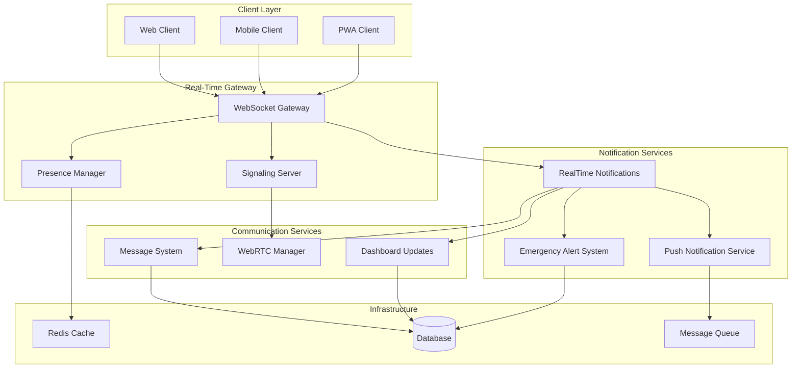

# Design Document: Real-Time Communication System

## Overview

The VitalMatch real-time communication system enhancement builds upon the existing Socket.io and WebRTC infrastructure to provide comprehensive real-time features including notifications, presence tracking, emergency alerts, and enhanced messaging. The system integrates multiple communication channels while maintaining high performance and security standards.

### Key Design Goals

- **Reliability**: Robust error handling and automatic reconnection for all real-time features
- **Scalability**: Support for 1000+ concurrent connections with sub-100ms latency
- **Security**: End-to-end encryption and comprehensive authentication
- **User Experience**: Seamless real-time updates with clear connection status feedback
- **Emergency Response**: Sub-10-second delivery for critical blood donation alerts

### System Context

The enhanced system extends the existing VitalMatch platform with:
- Integration of RealTimeNotifications service with SignalingServer
- Enhanced WebRTC capabilities with network quality monitoring
- Comprehensive presence system for user availability tracking
- Push notification support for mobile and web clients
- Emergency alert system for urgent blood requests
- Live dashboard updates with real-time statistics
- Enhanced messaging with typing indicators and delivery status

## Architecture

### High-Level Architecture



### Component Architecture

The system follows a layered architecture with clear separation of concerns:

**Gateway Layer**: Handles WebSocket connections, authentication, and routing
**Service Layer**: Implements business logic for notifications, presence, and messaging  
**Infrastructure Layer**: Provides caching, persistence, and message queuing

### Integration Points

- **Existing SignalingServer**: Enhanced with notification service integration
- **RealTimeNotifications**: Extended with presence tracking and emergency alerts
- **WebRTC Manager**: Improved with error handling and quality monitoring
- **Database Layer**: Leverages existing models with new presence and notification tables

## Components and Interfaces

### Enhanced WebSocket Gateway

**Purpose**: Central hub for all real-time communications with improved connection management

**Key Features**:
- Session-based authentication integration
- Connection pooling and load balancing
- Exponential backoff reconnection strategy
- Message queuing during disconnections
- Rate limiting and abuse prevention

**Interface**:
```javascript
class EnhancedWebSocketGateway {
  // Connection management
  handleConnection(socket, session)
  handleDisconnection(socket, reason)
  handleReconnection(socket, attemptCount)
  
  // Message routing
  routeMessage(socket, event, data)
  broadcastToUsers(userIds, event, data)
  broadcastToRoom(roomName, event, data)
  
  // Connection state
  getConnectionState(userId)
  getActiveConnections()
  getConnectionMetrics()
}
```

### Integrated Notification Service

**Purpose**: Unified notification delivery across all channels with presence awareness

**Key Features**:
- Integration with existing RealTimeNotifications service
- Presence-aware notification routing
- Message queuing for offline users
- Notification preferences and filtering
- Delivery confirmation tracking

**Interface**:
```javascript
class IntegratedNotificationService extends RealTimeNotifications {
  // Enhanced user management
  registerUserWithPresence(userId, socketId, initialStatus)
  updateUserPresence(userId, status, location)
  
  // Notification delivery
  sendNotificationWithFallback(userId, notification, fallbackChannels)
  sendEmergencyAlert(alertData, targetCriteria)
  queueOfflineNotification(userId, notification)
  
  // Presence integration
  getPresenceAwareRecipients(criteria)
  filterByAvailability(userIds, requiredStatus)
}
```

### Enhanced WebRTC Manager

**Purpose**: Reliable peer-to-peer communication with comprehensive error handling

**Key Features**:
- Automatic reconnection with exponential backoff
- Network quality monitoring and reporting
- Graceful fallback from video to audio
- Connection state management
- Media stream cleanup and optimization

**Interface**:
```javascript
class EnhancedWebRTCManager extends WebRTCManager {
  // Connection reliability
  attemptReconnection(maxAttempts, backoffStrategy)
  handleConnectionFailure(error, context)
  monitorNetworkQuality(callback)
  
  // Quality management
  adaptToNetworkConditions(qualityMetrics)
  fallbackToAudioOnly(reason)
  optimizeMediaSettings(constraints)
  
  // State management
  getDetailedConnectionState()
  cleanupResources(force)
}
```

### Presence System

**Purpose**: Real-time user status tracking with location and availability context

**Key Features**:
- Multi-status support (online/offline/away/busy)
- Location-based presence filtering
- Activity-based status updates
- Presence history and analytics
- Integration with notification routing

**Interface**:
```javascript
class PresenceSystem {
  // Status management
  setUserStatus(userId, status, metadata)
  getUserStatus(userId)
  getUsersWithStatus(status, filters)
  
  // Activity tracking
  updateLastActivity(userId, activity)
  handleInactivityTimeout(userId, duration)
  
  // Location integration
  updateUserLocation(userId, location)
  getUsersByLocation(location, radius)
  
  // Presence broadcasting
  broadcastPresenceUpdate(userId, status, recipients)
  subscribeToPresenceUpdates(userId, targetUsers)
}
```

### Push Notification Service

**Purpose**: Cross-platform push notification delivery with web and mobile support

**Key Features**:
- Web Push API integration
- Mobile push service integration (FCM/APNS)
- Device token management
- Notification templating and localization
- Delivery tracking and analytics

**Interface**:
```javascript
class PushNotificationService {
  // Device management
  registerDevice(userId, deviceToken, platform)
  updateDeviceToken(userId, oldToken, newToken)
  removeDevice(userId, deviceToken)
  
  // Notification delivery
  sendPushNotification(userId, notification, options)
  sendBulkNotifications(notifications, options)
  
  // Template management
  createNotificationTemplate(type, template)
  renderNotification(templateId, data, locale)
  
  // Analytics
  trackDelivery(notificationId, status)
  getDeliveryMetrics(timeRange, filters)
}
```

### Emergency Alert System

**Purpose**: High-priority notification system for urgent blood donation requests

**Key Features**:
- Sub-10-second delivery guarantee
- Location and blood type filtering
- Escalation and retry mechanisms
- Multi-channel delivery (WebSocket, Push, SMS)
- Response tracking and analytics

**Interface**:
```javascript
class EmergencyAlertSystem {
  // Alert creation
  createEmergencyAlert(requestData, criteria)
  escalateAlert(alertId, escalationLevel)
  
  // Targeting
  findEligibleDonors(bloodType, location, urgency)
  filterByAvailability(donors, timeWindow)
  
  // Delivery
  broadcastEmergencyAlert(alert, recipients)
  sendFollowupAlerts(alertId, interval)
  
  // Tracking
  trackAlertResponse(alertId, userId, response)
  getAlertMetrics(alertId)
}
```

### Live Dashboard Updates

**Purpose**: Real-time dashboard synchronization with optimized data delivery

**Key Features**:
- Incremental data updates
- User-specific dashboard filtering
- Real-time statistics computation
- Efficient data serialization
- Update batching and throttling

**Interface**:
```javascript
class LiveDashboardUpdates {
  // Dashboard management
  subscribeToDashboard(userId, dashboardType)
  unsubscribeFromDashboard(userId, dashboardType)
  
  // Data updates
  broadcastStatisticsUpdate(statistics, recipients)
  sendPersonalizedUpdate(userId, updateData)
  
  // Optimization
  batchUpdates(updates, timeWindow)
  throttleUpdates(userId, maxRate)
  
  // Data computation
  computeRealTimeStatistics(scope, filters)
  generateDashboardSnapshot(userId, dashboardType)
}
```

### Enhanced Message System

**Purpose**: Feature-rich messaging with typing indicators, delivery status, and encryption

**Key Features**:
- Real-time typing indicators
- Message delivery and read receipts
- End-to-end encryption
- Message history synchronization
- Multi-device message sync

**Interface**:
```javascript
class EnhancedMessageSystem {
  // Messaging
  sendMessage(senderId, recipientId, message, options)
  broadcastTypingIndicator(senderId, recipientId, isTyping)
  
  // Status tracking
  updateMessageStatus(messageId, status, userId)
  getMessageDeliveryStatus(messageId)
  
  // Encryption
  encryptMessage(message, recipientPublicKey)
  decryptMessage(encryptedMessage, privateKey)
  
  // Synchronization
  syncMessageHistory(userId, deviceId, lastSync)
  resolveMessageConflicts(conflicts)
}
```

## Data Models

### Enhanced User Presence Model

```javascript
const UserPresence = {
  userId: String,           // User identifier
  status: String,           // online, offline, away, busy
  lastSeen: Date,          // Last activity timestamp
  location: {              // Optional location data
    latitude: Number,
    longitude: Number,
    address: String
  },
  metadata: {              // Additional presence context
    device: String,        // Device type
    activity: String,      // Current activity
    availability: Boolean  // Available for calls/messages
  },
  connections: [{          // Active connections
    socketId: String,
    connectedAt: Date,
    userAgent: String
  }],
  createdAt: Date,
  updatedAt: Date
};
```

### Notification Queue Model

```javascript
const NotificationQueue = {
  id: String,              // Unique notification ID
  userId: String,          // Target user
  type: String,            // Notification type
  priority: String,        // low, normal, high, emergency
  channels: [String],      // websocket, push, sms, email
  payload: {               // Notification content
    title: String,
    message: String,
    data: Object,
    actions: [Object]
  },
  status: String,          // pending, delivered, failed, expired
  attempts: Number,        // Delivery attempts
  scheduledFor: Date,      // Delivery time
  deliveredAt: Date,       // Actual delivery time
  expiresAt: Date,         // Expiration time
  createdAt: Date
};
```

### Emergency Alert Model

```javascript
const EmergencyAlert = {
  id: String,              // Unique alert ID
  requestId: String,       // Associated blood request
  bloodType: String,       // Required blood type
  urgency: String,         // low, medium, high, critical
  location: {              // Emergency location
    latitude: Number,
    longitude: Number,
    address: String,
    radius: Number         // Search radius in km
  },
  criteria: {              // Targeting criteria
    bloodTypes: [String],
    maxDistance: Number,
    minAge: Number,
    maxAge: Number
  },
  status: String,          // active, fulfilled, expired, cancelled
  escalationLevel: Number, // Current escalation level
  recipients: [{           // Alert recipients
    userId: String,
    deliveredAt: Date,
    response: String,      // interested, not_available, no_response
    responseAt: Date
  }],
  metrics: {               // Alert performance
    totalSent: Number,
    totalDelivered: Number,
    totalResponses: Number,
    averageResponseTime: Number
  },
  createdAt: Date,
  updatedAt: Date,
  expiresAt: Date
};
```

### Connection State Model

```javascript
const ConnectionState = {
  userId: String,          // User identifier
  socketId: String,        // Socket connection ID
  status: String,          // connected, reconnecting, disconnected
  connectionType: String,  // websocket, webrtc, hybrid
  quality: {               // Connection quality metrics
    latency: Number,       // Round-trip time in ms
    bandwidth: Number,     // Available bandwidth
    packetLoss: Number,    // Packet loss percentage
    jitter: Number         // Network jitter
  },
  reconnectionAttempts: Number,
  lastReconnectAt: Date,
  connectedAt: Date,
  lastActivityAt: Date,
  userAgent: String,
  ipAddress: String
};
```

### Message Delivery Model

```javascript
const MessageDelivery = {
  messageId: String,       // Message identifier
  senderId: String,        // Message sender
  recipientId: String,     // Message recipient
  status: String,          // sent, delivered, read, failed
  deliveryChannel: String, // websocket, push, sms
  sentAt: Date,           // Send timestamp
  deliveredAt: Date,      // Delivery timestamp
  readAt: Date,           // Read timestamp
  failureReason: String,  // Failure details if applicable
  retryCount: Number,     // Delivery retry attempts
  metadata: {             // Additional delivery context
    deviceId: String,
    platform: String,
    networkType: String
  }
};
```

### Push Device Model

```javascript
const PushDevice = {
  userId: String,          // Device owner
  deviceToken: String,     // Push notification token
  platform: String,       // ios, android, web
  deviceInfo: {            // Device details
    model: String,
    osVersion: String,
    appVersion: String,
    userAgent: String
  },
  preferences: {           // Notification preferences
    enabled: Boolean,
    types: [String],       // Allowed notification types
    quietHours: {          // Do not disturb settings
      enabled: Boolean,
      startTime: String,
      endTime: String,
      timezone: String
    }
  },
  isActive: Boolean,       // Device status
  lastUsedAt: Date,
  registeredAt: Date,
  updatedAt: Date
};
```

## Correctness Properties

*A property is a characteristic or behavior that should hold true across all valid executions of a system-essentially, a formal statement about what the system should do. Properties serve as the bridge between human-readable specifications and machine-verifiable correctness guarantees.*

### Property 1: User Connection Registration

*For any* user connecting to the system, the Notification_Service should register their socket connection and maintain it in the active connections mapping.

**Validates: Requirements 1.2, 1.4**

### Property 2: Connection Cleanup on Disconnect

*For any* user disconnecting from the system, the Notification_Service should clean up their socket registration and remove them from active connections.

**Validates: Requirements 1.3**

### Property 3: Offline Notification Queuing

*For any* notification sent to an offline user, the system should queue the notification and deliver it upon user reconnection.

**Validates: Requirements 1.5**

### Property 4: WebRTC Reconnection Attempts

*For any* WebRTC connection failure, the system should attempt automatic reconnection exactly 3 times before giving up.

**Validates: Requirements 2.2**

### Property 5: Network Quality Monitoring

*For any* active WebRTC call, the system should provide network quality indicators throughout the call duration.

**Validates: Requirements 2.3**

### Property 6: Quality Degradation Notifications

*For any* WebRTC call where network quality degrades below acceptable levels, the system should notify users and suggest improvements.

**Validates: Requirements 2.4**

### Property 7: Bandwidth Fallback

*For any* video call with insufficient bandwidth, the system should gracefully fallback to audio-only mode.

**Validates: Requirements 2.5**

### Property 8: Resource Cleanup

*For any* WebRTC connection that ends, the system should properly cleanup all media streams and peer connections.

**Validates: Requirements 2.6**

### Property 9: Presence Status Tracking

*For any* user status change (online/offline/away/busy), the Presence_System should accurately track and store the new status.

**Validates: Requirements 3.1**

### Property 10: Login Status Update

*For any* user login event, the Presence_System should set their status to online.

**Validates: Requirements 3.2**

### Property 11: Inactivity Timeout

*For any* user inactive for 5 minutes, the Presence_System should automatically set their status to away.

**Validates: Requirements 3.3**

### Property 12: Application Closure Status

*For any* user closing the application, the Presence_System should set their status to offline.

**Validates: Requirements 3.4**

### Property 13: Presence Broadcast Timing

*For any* presence status change, the system should broadcast updates to relevant users within 2 seconds.

**Validates: Requirements 3.5**

### Property 14: Last Seen Persistence

*For any* user going offline, the system should persist their last seen timestamp.

**Validates: Requirements 3.6**

### Property 15: Device Token Registration

*For any* user granting notification permissions, the Push_Notification_Service should register their device token.

**Validates: Requirements 4.3**

### Property 16: Emergency Notification Timing

*For any* emergency blood request, the system should send push notifications within 30 seconds.

**Validates: Requirements 4.4**

### Property 17: Actionable Notification Content

*For any* push notification sent, the system should include actionable buttons for quick responses.

**Validates: Requirements 4.5**

### Property 18: Notification Preferences Respect

*For any* notification delivery, the system should respect user notification preferences and do-not-disturb settings.

**Validates: Requirements 4.6**

### Property 19: Emergency Alert Targeting

*For any* emergency blood request, the system should broadcast alerts to all online users matching blood type compatibility.

**Validates: Requirements 5.1**

### Property 20: Emergency Alert Speed

*For any* emergency request creation, the system should send notifications within 10 seconds.

**Validates: Requirements 5.2**

### Property 21: Location-Based Emergency Filtering

*For any* emergency alert with location criteria, the system should only notify users within the specified range.

**Validates: Requirements 5.3**

### Property 22: Emergency Alert Escalation

*For any* unfulfilled emergency request, the system should escalate notifications every 5 minutes until fulfilled.

**Validates: Requirements 5.4**

### Property 23: Emergency Response Tracking

*For any* emergency alert sent, the system should track response rates and delivery confirmations.

**Validates: Requirements 5.6**

### Property 24: Real-Time Statistics Updates

*For any* change to blood requests or donations, the Dashboard_Updates should provide real-time statistics updates.

**Validates: Requirements 6.1**

### Property 25: Dashboard Update Timing

*For any* new blood request creation, the system should update relevant user dashboards within 3 seconds.

**Validates: Requirements 6.2**

### Property 26: Live Counter Accuracy

*For any* system state change, the dashboard should show accurate live counters for active donors, pending requests, and successful matches.

**Validates: Requirements 6.3**

### Property 27: User-Specific Metric Updates

*For any* change to user-specific data, the system should update their metrics like donation history and eligibility status.

**Validates: Requirements 6.4**

### Property 28: Status Change Notifications

*For any* blood request status change, the system should provide real-time notifications to the requesting user.

**Validates: Requirements 6.5**

### Property 29: Multi-Session Data Consistency

*For any* user with multiple active sessions, the system should maintain data consistency across all sessions.

**Validates: Requirements 6.6**

### Property 30: Typing Indicator Display

*For any* user composing a message, the system should display typing indicators to recipients.

**Validates: Requirements 7.1**

### Property 31: Typing Indicator Timing

*For any* user starting to type, the system should show typing indicators to recipients within 1 second.

**Validates: Requirements 7.2**

### Property 32: Message Status Indicators

*For any* message sent, the system should show delivery and read status indicators.

**Validates: Requirements 7.3**

### Property 33: Multi-Device Message Sync

*For any* message sent on one device, the system should synchronize it to all other user devices in real-time.

**Validates: Requirements 7.4**

### Property 34: Message History Persistence

*For any* message sent, the system should persist it and make it retrievable in message history.

**Validates: Requirements 7.5**

### Property 35: Message Encryption

*For any* message transmitted, the system should implement encryption for secure communication.

**Validates: Requirements 7.6**

### Property 36: Connection State Display

*For any* connection state change, the system should display the current connection state to users.

**Validates: Requirements 8.1**

### Property 37: Reconnection Status Display

*For any* connection loss, the system should show reconnection attempts and status to users.

**Validates: Requirements 8.2**

### Property 38: Exponential Backoff Implementation

*For any* series of reconnection attempts, the system should implement exponential backoff timing.

**Validates: Requirements 8.3**

### Property 39: Message Queuing During Disconnection

*For any* outgoing message or notification during disconnection, the system should queue it for later delivery.

**Validates: Requirements 8.4**

### Property 40: Reconnection Message Delivery

*For any* connection restoration after disconnection, the system should deliver queued messages and sync missed notifications.

**Validates: Requirements 8.5**

### Property 41: Offline Mode Indicators

*For any* offline state, the system should provide offline mode indicators and appropriately limit functionality.

**Validates: Requirements 8.6**

### Property 42: Concurrent Connection Capacity

*For any* system load up to 1000 concurrent WebSocket connections, the system should handle all connections successfully.

**Validates: Requirements 9.1**

### Property 43: Message Delivery Latency

*For any* batch of notifications sent, 95% should be delivered within 100ms.

**Validates: Requirements 9.2**

### Property 44: Monitoring Metrics Availability

*For any* system operation, the system should provide monitoring and metrics for connection counts and message throughput.

**Validates: Requirements 9.4**

### Property 45: Rate Limiting Protection

*For any* excessive notification or request activity, the system should implement rate limiting to prevent spam and abuse.

**Validates: Requirements 9.5, 10.4**

### Property 46: WebSocket Authentication

*For any* WebSocket connection attempt, the system should authenticate using session-based authentication.

**Validates: Requirements 10.1**

### Property 47: TLS Encryption

*For any* real-time communication, the system should encrypt it using TLS.

**Validates: Requirements 10.2**

### Property 48: Permission Validation

*For any* notification delivery attempt, the system should validate user permissions before delivery.

**Validates: Requirements 10.3**

### Property 49: Security Event Logging

*For any* security event or failed authentication attempt, the system should log the event appropriately.

**Validates: Requirements 10.5**

### Property 50: Content Sanitization

*For any* user-generated content in real-time messages, the system should sanitize it before transmission.

**Validates: Requirements 10.6**

## Error Handling

### Connection Error Handling

**WebSocket Connection Failures**:
- Implement exponential backoff with jitter for reconnection attempts
- Maximum 3 reconnection attempts before requiring user intervention
- Graceful degradation to offline mode with queued message delivery
- Clear user feedback about connection status and retry attempts

**WebRTC Connection Failures**:
- Automatic ICE candidate gathering retry on failure
- Fallback to TURN servers when direct connection fails
- Graceful degradation from video to audio-only calls
- Connection quality monitoring with user notifications

### Notification Delivery Failures

**Push Notification Failures**:
- Retry mechanism with exponential backoff
- Fallback to alternative notification channels (WebSocket, email)
- Device token validation and cleanup for invalid tokens
- Delivery confirmation tracking and failure analytics

**Emergency Alert Failures**:
- Immediate retry for failed emergency notifications
- Escalation to multiple channels (push, SMS, email)
- Administrative alerts for emergency system failures
- Backup notification systems for critical alerts

### Data Consistency Errors

**Presence System Failures**:
- Periodic presence state reconciliation
- Conflict resolution for simultaneous status updates
- Fallback to last known good state on corruption
- Presence heartbeat mechanism for connection validation

**Message Delivery Failures**:
- Message queuing with persistent storage
- Duplicate message detection and prevention
- Out-of-order message handling and resequencing
- Message encryption key recovery mechanisms

### Performance Degradation Handling

**High Load Scenarios**:
- Connection throttling and load balancing
- Message batching and compression
- Priority-based notification delivery
- Circuit breaker pattern for external services

**Resource Exhaustion**:
- Memory usage monitoring and cleanup
- Connection pooling and resource limits
- Garbage collection optimization
- Graceful service degradation under load

## Testing Strategy

### Dual Testing Approach

The real-time communication system requires both unit testing and property-based testing to ensure comprehensive coverage:

**Unit Tests**: Focus on specific examples, edge cases, and integration points
- WebSocket connection establishment and cleanup
- Message encryption/decryption with known keys
- Emergency alert targeting with specific blood types and locations
- Presence status transitions for specific user scenarios
- Push notification formatting and delivery confirmation

**Property Tests**: Verify universal properties across all inputs with minimum 100 iterations each
- Connection management properties (registration, cleanup, state consistency)
- Timing properties (notification delivery, presence updates, reconnection)
- Security properties (authentication, encryption, permission validation)
- Performance properties (latency, throughput, concurrent connections)
- Data consistency properties (message delivery, presence synchronization)

### Property-Based Testing Configuration

**Testing Framework**: Use fast-check for JavaScript property-based testing
**Iteration Count**: Minimum 100 iterations per property test
**Test Tagging**: Each property test must reference its design document property

Example test tags:
- **Feature: real-time-communication-system, Property 1**: User Connection Registration
- **Feature: real-time-communication-system, Property 15**: Device Token Registration
- **Feature: real-time-communication-system, Property 43**: Message Delivery Latency

### Integration Testing

**WebSocket Integration**:
- Multi-client connection scenarios
- Message broadcasting and delivery confirmation
- Connection state synchronization across clients
- Error recovery and reconnection testing

**WebRTC Integration**:
- Peer-to-peer connection establishment
- Media stream handling and quality adaptation
- Network condition simulation and fallback testing
- Cross-browser compatibility testing

**External Service Integration**:
- Push notification service integration (FCM, APNS, Web Push)
- Database consistency during high-load scenarios
- Redis caching and session management
- Email service fallback for critical notifications

### Performance Testing

**Load Testing**:
- 1000+ concurrent WebSocket connections
- Message throughput under various load conditions
- Memory usage and garbage collection impact
- Database query performance under load

**Latency Testing**:
- End-to-end message delivery timing
- Presence update propagation speed
- Emergency alert delivery performance
- WebRTC connection establishment time

### Security Testing

**Authentication Testing**:
- Session-based WebSocket authentication
- Token validation and expiration handling
- Permission-based notification filtering
- Rate limiting and abuse prevention

**Encryption Testing**:
- TLS encryption for all communications
- Message content encryption validation
- Key management and rotation testing
- Man-in-the-middle attack prevention