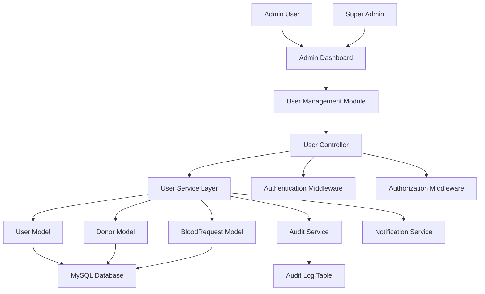
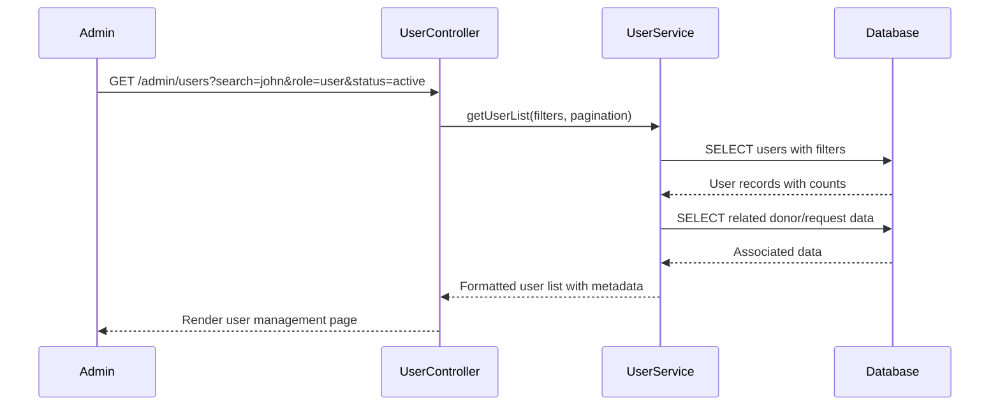
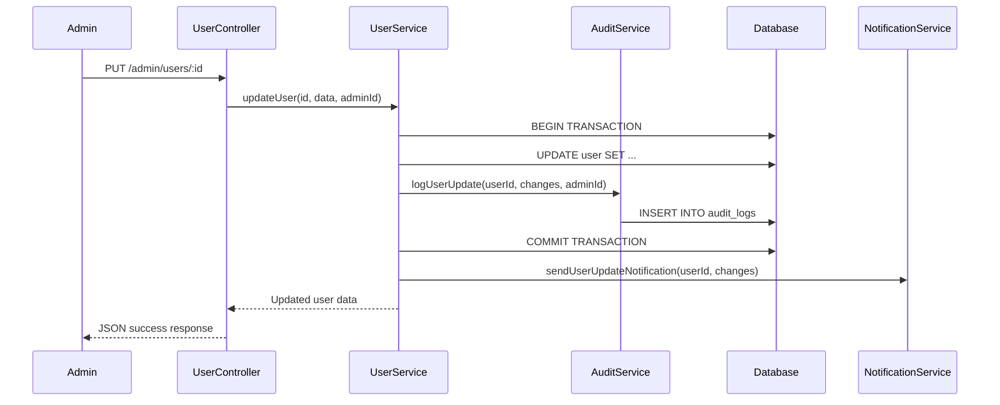

# Design Document: User Management

## Overview

The User Management feature provides comprehensive administrative capabilities for managing all users in the VitalMatch blood donation system. This includes CRUD operations for users, role management, account status control, bulk operations, and detailed user analytics. The system supports three user types: regular users (donors/requesters), hospital administrators, and system administrators, with appropriate access controls and audit trails.

## Architecture



## Sequence Diagrams

### User List and Search Flow



### User Profile Update Flow



## Components and Interfaces

### Component 1: UserController

**Purpose**: Handles HTTP requests for user management operations

**Interface**:
```javascript
class UserController {
  // Display user management page
  getUserManagementPage(req, res): Promise<void>
  
  // Get paginated user list with filters
  getUserList(req, res): Promise<void>
  
  // Get single user details
  getUserDetails(req, res): Promise<void>
  
  // Create new user
  createUser(req, res): Promise<void>
  
  // Update user information
  updateUser(req, res): Promise<void>
  
  // Delete user (soft delete)
  deleteUser(req, res): Promise<void>
  
  // Bulk operations
  bulkUpdateUsers(req, res): Promise<void>
  bulkDeleteUsers(req, res): Promise<void>
  
  // Role and status management
  updateUserRole(req, res): Promise<void>
  updateUserStatus(req, res): Promise<void>
  
  // Password management
  resetUserPassword(req, res): Promise<void>
  
  // Export functionality
  exportUsers(req, res): Promise<void>
}
```

**Responsibilities**:
- Request validation and sanitization
- Authentication and authorization checks
- Response formatting and error handling
- Session management for admin operations

### Component 2: UserService

**Purpose**: Business logic layer for user management operations

**Interface**:
```javascript
class UserService {
  // Core CRUD operations
  getUserList(filters, pagination): Promise<UserListResult>
  getUserById(id): Promise<UserDetails>
  createUser(userData, adminId): Promise<User>
  updateUser(id, userData, adminId): Promise<User>
  deleteUser(id, adminId): Promise<boolean>
  
  // Advanced operations
  bulkUpdateUsers(userIds, updates, adminId): Promise<BulkResult>
  bulkDeleteUsers(userIds, adminId): Promise<BulkResult>
  
  // Role and status management
  updateUserRole(userId, newRole, adminId): Promise<User>
  updateUserStatus(userId, status, adminId): Promise<User>
  
  // Password operations
  resetPassword(userId, adminId): Promise<string>
  generateTemporaryPassword(): string
  
  // Analytics and reporting
  getUserStatistics(): Promise<UserStats>
  getUserActivityReport(userId): Promise<ActivityReport>
  
  // Search and filtering
  searchUsers(query, filters): Promise<User[]>
  
  // Data export
  exportUsersToCSV(filters): Promise<string>
}
```

**Responsibilities**:
- Business rule enforcement
- Data validation and transformation
- Audit trail management
- Integration with notification services

### Component 3: AuditService

**Purpose**: Tracks all user management operations for compliance and security

**Interface**:
```javascript
class AuditService {
  logUserCreation(userId, adminId, userData): Promise<void>
  logUserUpdate(userId, adminId, changes): Promise<void>
  logUserDeletion(userId, adminId, reason): Promise<void>
  logRoleChange(userId, adminId, oldRole, newRole): Promise<void>
  logStatusChange(userId, adminId, oldStatus, newStatus): Promise<void>
  logPasswordReset(userId, adminId): Promise<void>
  logBulkOperation(operation, userIds, adminId): Promise<void>
  
  getAuditTrail(userId, limit): Promise<AuditEntry[]>
  getAdminActivity(adminId, dateRange): Promise<AuditEntry[]>
}
```

**Responsibilities**:
- Comprehensive audit logging
- Compliance reporting
- Security monitoring
- Data retention management

## Data Models

### Model 1: Enhanced User Model

```javascript
interface User {
  id: number
  firstName: string
  lastName: string
  email: string
  password: string
  phone: string
  address: string
  dateOfBirth: Date
  gender: string
  role: 'user' | 'admin' | 'hospital_admin'
  status: 'active' | 'inactive' | 'suspended' | 'pending'
  emailVerified: boolean
  phoneVerified: boolean
  lastLoginAt: Date
  createdAt: Date
  updatedAt: Date
  createdBy: number
  updatedBy: number
}
```

**Validation Rules**:
- Email must be unique and valid format
- Phone must be valid format and unique
- Role must be one of allowed values
- Status transitions must follow business rules
- Password must meet security requirements

### Model 2: UserAuditLog Model

```javascript
interface UserAuditLog {
  id: number
  userId: number
  adminId: number
  action: string
  tableName: string
  oldValues: JSON
  newValues: JSON
  ipAddress: string
  userAgent: string
  timestamp: Date
}
```

**Validation Rules**:
- Action must be from predefined list
- JSON fields must be valid JSON
- Timestamp must be current server time
- IP address must be valid format

### Model 3: UserSession Model

```javascript
interface UserSession {
  id: number
  userId: number
  sessionToken: string
  ipAddress: string
  userAgent: string
  isActive: boolean
  expiresAt: Date
  createdAt: Date
}
```

**Validation Rules**:
- Session token must be unique and secure
- Expiration must be future date
- Only one active session per user (configurable)

## Algorithmic Pseudocode

### Main User List Retrieval Algorithm

```pascal
ALGORITHM getUserListWithFilters(filters, pagination)
INPUT: filters (search, role, status, dateRange), pagination (page, limit, sort)
OUTPUT: result of type UserListResult

BEGIN
  ASSERT filters IS NOT NULL AND pagination IS NOT NULL
  ASSERT pagination.page >= 1 AND pagination.limit > 0
  
  // Step 1: Build dynamic WHERE clause
  whereClause ← buildWhereClause(filters)
  
  // Step 2: Calculate offset for pagination
  offset ← (pagination.page - 1) * pagination.limit
  
  // Step 3: Execute main query with joins
  users ← EXECUTE_QUERY(
    "SELECT u.*, 
            COUNT(d.id) as donorProfileCount,
            COUNT(br.id) as bloodRequestCount,
            MAX(br.createdAt) as lastRequestDate
     FROM Users u
     LEFT JOIN Donors d ON u.id = d.userId
     LEFT JOIN BloodRequests br ON u.id = br.userId
     WHERE " + whereClause + "
     GROUP BY u.id
     ORDER BY " + pagination.sort + "
     LIMIT " + pagination.limit + " OFFSET " + offset
  )
  
  // Step 4: Get total count for pagination
  totalCount ← EXECUTE_QUERY(
    "SELECT COUNT(DISTINCT u.id) FROM Users u WHERE " + whereClause
  )
  
  // Step 5: Calculate pagination metadata
  totalPages ← CEILING(totalCount / pagination.limit)
  hasNextPage ← pagination.page < totalPages
  hasPrevPage ← pagination.page > 1
  
  ASSERT users IS NOT NULL
  ASSERT totalCount >= 0
  
  RETURN UserListResult{
    users: users,
    pagination: {
      currentPage: pagination.page,
      totalPages: totalPages,
      totalCount: totalCount,
      hasNextPage: hasNextPage,
      hasPrevPage: hasPrevPage
    }
  }
END
```

**Preconditions**:
- Database connection is established and active
- filters parameter contains valid filter criteria
- pagination parameters are positive integers
- User has admin privileges (verified by middleware)

**Postconditions**:
- Returns valid UserListResult with users array
- Pagination metadata is accurate and consistent
- Query execution time is within acceptable limits (<2 seconds)
- No sensitive data (passwords) included in results

**Loop Invariants**:
- All returned users have valid IDs and required fields
- Pagination calculations remain consistent throughout processing

### User Update with Audit Trail Algorithm

```pascal
ALGORITHM updateUserWithAudit(userId, updateData, adminId)
INPUT: userId (positive integer), updateData (object), adminId (positive integer)
OUTPUT: updatedUser of type User

BEGIN
  ASSERT userId > 0 AND adminId > 0
  ASSERT updateData IS NOT NULL AND updateData IS NOT EMPTY
  
  // Step 1: Validate admin permissions
  admin ← findUserById(adminId)
  ASSERT admin IS NOT NULL AND admin.role IN ['admin', 'super_admin']
  
  // Step 2: Fetch current user data
  currentUser ← findUserById(userId)
  ASSERT currentUser IS NOT NULL
  
  // Step 3: Validate update data
  validatedData ← validateUserUpdateData(updateData)
  ASSERT validatedData IS VALID
  
  // Step 4: Check for actual changes
  changes ← detectChanges(currentUser, validatedData)
  IF changes IS EMPTY THEN
    RETURN currentUser
  END IF
  
  // Step 5: Begin database transaction
  BEGIN_TRANSACTION()
  
  TRY
    // Step 6: Update user record
    updatedUser ← EXECUTE_UPDATE(
      "UPDATE Users SET " + buildUpdateClause(validatedData) + 
      ", updatedBy = " + adminId + 
      ", updatedAt = NOW() WHERE id = " + userId
    )
    
    // Step 7: Create audit log entry
    auditEntry ← AuditLog{
      userId: userId,
      adminId: adminId,
      action: 'USER_UPDATE',
      tableName: 'Users',
      oldValues: extractChangedFields(currentUser, changes),
      newValues: extractChangedFields(validatedData, changes),
      ipAddress: getCurrentIPAddress(),
      userAgent: getCurrentUserAgent(),
      timestamp: NOW()
    }
    
    INSERT_AUDIT_LOG(auditEntry)
    
    // Step 8: Send notifications if needed
    IF shouldNotifyUser(changes) THEN
      sendUserUpdateNotification(userId, changes)
    END IF
    
    COMMIT_TRANSACTION()
    
    ASSERT updatedUser IS NOT NULL
    ASSERT updatedUser.updatedAt > currentUser.updatedAt
    
    RETURN updatedUser
    
  CATCH error
    ROLLBACK_TRANSACTION()
    THROW UserUpdateException(error.message)
  END TRY
END
```

**Preconditions**:
- userId exists in database
- adminId exists and has admin privileges
- updateData contains valid field updates
- Database transaction support is available

**Postconditions**:
- User record is updated with new values
- Audit log entry is created
- Transaction is committed or rolled back completely
- Notifications are sent if required
- Updated user object is returned

**Loop Invariants**:
- Database remains in consistent state throughout transaction
- All changes are tracked in audit log
- User data integrity is maintained

### Bulk User Operations Algorithm

```pascal
ALGORITHM bulkUpdateUsers(userIds, updateData, adminId)
INPUT: userIds (array of integers), updateData (object), adminId (integer)
OUTPUT: result of type BulkOperationResult

BEGIN
  ASSERT userIds IS NOT NULL AND LENGTH(userIds) > 0
  ASSERT updateData IS NOT NULL
  ASSERT adminId > 0
  
  // Step 1: Validate batch size
  IF LENGTH(userIds) > MAX_BULK_SIZE THEN
    THROW BulkOperationException("Batch size exceeds maximum allowed")
  END IF
  
  // Step 2: Initialize result tracking
  successCount ← 0
  failureCount ← 0
  errors ← EMPTY_ARRAY
  
  // Step 3: Begin transaction for entire batch
  BEGIN_TRANSACTION()
  
  TRY
    // Step 4: Process each user with loop invariant
    FOR each userId IN userIds DO
      ASSERT successCount + failureCount <= LENGTH(userIds)
      
      TRY
        // Validate user exists and is updatable
        user ← findUserById(userId)
        IF user IS NULL THEN
          errors.ADD("User " + userId + " not found")
          failureCount ← failureCount + 1
          CONTINUE
        END IF
        
        // Apply updates
        updatedUser ← updateUserRecord(userId, updateData, adminId)
        
        // Log audit entry
        logBulkUpdateAudit(userId, adminId, updateData)
        
        successCount ← successCount + 1
        
      CATCH userError
        errors.ADD("User " + userId + ": " + userError.message)
        failureCount ← failureCount + 1
      END TRY
    END FOR
    
    // Step 5: Validate operation success threshold
    successRate ← successCount / LENGTH(userIds)
    IF successRate < MIN_SUCCESS_RATE THEN
      ROLLBACK_TRANSACTION()
      THROW BulkOperationException("Success rate below threshold")
    END IF
    
    COMMIT_TRANSACTION()
    
    ASSERT successCount + failureCount = LENGTH(userIds)
    
    RETURN BulkOperationResult{
      totalProcessed: LENGTH(userIds),
      successCount: successCount,
      failureCount: failureCount,
      errors: errors,
      successRate: successRate
    }
    
  CATCH batchError
    ROLLBACK_TRANSACTION()
    THROW BulkOperationException(batchError.message)
  END TRY
END
```

**Preconditions**:
- userIds array contains valid user IDs
- updateData contains valid update fields
- adminId has bulk operation privileges
- Batch size is within system limits

**Postconditions**:
- All successful updates are committed
- Failed operations are logged with reasons
- Transaction is atomic (all or nothing if below threshold)
- Comprehensive result summary is returned

**Loop Invariants**:
- successCount + failureCount never exceeds total user count
- Each processed user is either successful or has error logged
- Database consistency maintained throughout batch processing

## Key Functions with Formal Specifications

### Function 1: validateUserData()

```javascript
function validateUserData(userData, isUpdate = false): ValidationResult
```

**Preconditions:**
- `userData` is non-null object
- `isUpdate` is boolean indicating update vs create operation

**Postconditions:**
- Returns ValidationResult with isValid boolean and errors array
- If valid: all required fields are present and properly formatted
- If invalid: errors array contains specific validation messages
- No mutations to input userData object

**Loop Invariants:** N/A

### Function 2: checkUserPermissions()

```javascript
function checkUserPermissions(adminId, targetUserId, operation): boolean
```

**Preconditions:**
- `adminId` is positive integer of authenticated admin
- `targetUserId` is positive integer of user being operated on
- `operation` is valid operation string

**Postconditions:**
- Returns true if and only if admin has permission for operation
- Super admins can perform all operations
- Regular admins cannot modify other admins
- Self-modification has special rules

**Loop Invariants:** N/A

### Function 3: buildUserSearchQuery()

```javascript
function buildUserSearchQuery(filters, pagination): QueryObject
```

**Preconditions:**
- `filters` object contains valid search criteria
- `pagination` object contains valid page/limit/sort parameters

**Postconditions:**
- Returns QueryObject with SQL query and parameters
- Query is SQL injection safe (parameterized)
- Pagination limits are enforced
- Search terms are properly escaped

**Loop Invariants:**
- For filter processing loops: All processed filters are valid and safe

## Example Usage

```javascript
// Example 1: Get paginated user list with filters
const filters = {
  search: 'john',
  role: 'user',
  status: 'active',
  dateRange: { start: '2024-01-01', end: '2024-12-31' }
};

const pagination = {
  page: 1,
  limit: 20,
  sort: 'createdAt DESC'
};

const userList = await userService.getUserList(filters, pagination);

// Example 2: Update user with audit trail
const updateData = {
  firstName: 'John',
  lastName: 'Doe',
  phone: '+1234567890',
  status: 'active'
};

const updatedUser = await userService.updateUser(123, updateData, adminId);

// Example 3: Bulk role update
const userIds = [101, 102, 103, 104];
const bulkUpdate = { role: 'hospital_admin' };

const result = await userService.bulkUpdateUsers(userIds, bulkUpdate, adminId);

// Example 4: Export users to CSV
const exportFilters = { role: 'user', status: 'active' };
const csvData = await userService.exportUsersToCSV(exportFilters);
```

## Correctness Properties

*A property is a characteristic or behavior that should hold true across all valid executions of a system-essentially, a formal statement about what the system should do. Properties serve as the bridge between human-readable specifications and machine-verifiable correctness guarantees.*

### Property 1: Comprehensive Audit Logging

*For any* user management operation (create, update, delete, role change, password reset, bulk operation, or data export), the Audit_Service should create a detailed log entry containing the admin identity, timestamp, operation type, and specific changes made.

**Validates: Requirements 2.3, 4.3, 5.5, 6.3, 7.3, 8.1, 8.2, 9.5**

### Property 2: Search and Filter Consistency

*For any* search query or filter criteria applied to user lists, audit data, or export operations, all returned results should match the specified criteria exactly and be properly ordered.

**Validates: Requirements 1.2, 1.5, 8.4, 9.1**

### Property 3: Input Validation Completeness

*For any* user data input (creation, update, role change, or status change), the System should validate all fields according to business rules and reject invalid data with specific error messages.

**Validates: Requirements 2.2, 2.5, 3.2, 3.5, 4.1, 6.5, 11.4**

### Property 4: Transaction Atomicity for Bulk Operations

*For any* bulk operation on multiple users, the System should process all users within a single transaction such that either all operations succeed or all operations fail, maintaining data consistency.

**Validates: Requirements 5.2, 5.3**

### Property 5: Access Control Enforcement

*For any* user management operation attempt, the System should verify admin authentication and authorization, denying access to operations beyond the admin's role and logging unauthorized attempts.

**Validates: Requirements 10.1, 10.2, 10.3**

### Property 6: Notification Consistency

*For any* significant user account change (profile updates, role changes, status changes, password resets, or successful user creation), the System should send appropriate notifications to affected users.

**Validates: Requirements 2.4, 3.4, 4.5, 6.4**

### Property 7: Soft Delete Data Preservation

*For any* user deletion operation, the System should perform a soft delete that preserves the user's donation history, request history, and audit trail while preventing future authentication.

**Validates: Requirements 7.1, 7.2, 7.4, 7.5**

### Property 8: Password Security Standards

*For any* password operation (reset or temporary password generation), the System should generate secure passwords meeting security requirements and set appropriate flags for password change requirements.

**Validates: Requirements 3.3, 6.1, 6.2**

### Property 9: Data Export Security

*For any* data export operation, the System should exclude sensitive information (passwords, tokens, session data) while including all requested non-sensitive user data in the specified format.

**Validates: Requirements 9.2, 9.3**

### Property 10: User Interface Data Completeness

*For any* user list display or user profile view, the System should include all required user information fields (name, email, role, status, last login date) in the rendered output.

**Validates: Requirements 1.3, 11.5**

### Property 11: Status Transition Validation

*For any* user status change attempt, the System should enforce valid status transitions according to business rules, invalidate sessions when appropriate, and maintain referential integrity.

**Validates: Requirements 4.2, 4.4**

### Property 12: Concurrent Operation Safety

*For any* simultaneous administrative operations on the same user data, the System should prevent conflicting modifications and maintain data consistency through proper concurrency control.

**Validates: Requirements 10.4**

### Property-Based Test Assertions

```javascript
// Property: User search results always match filter criteria
property('search results match filters', (filters) => {
  const results = userService.searchUsers(query, filters);
  return results.every(user => matchesFilters(user, filters));
});

// Property: Bulk operations maintain data consistency
property('bulk operations are atomic', (userIds, updateData) => {
  const initialState = getUserStates(userIds);
  try {
    const result = userService.bulkUpdateUsers(userIds, updateData, adminId);
    const finalState = getUserStates(userIds);
    return result.successCount === userIds.length || 
           deepEqual(initialState, finalState);
  } catch (error) {
    const rollbackState = getUserStates(userIds);
    return deepEqual(initialState, rollbackState);
  }
});

// Property: Audit logs are complete and accurate
property('audit logs capture all changes', (userId, updateData) => {
  const beforeState = getUserById(userId);
  const updatedUser = userService.updateUser(userId, updateData, adminId);
  const auditEntries = auditService.getAuditTrail(userId, 1);
  
  return auditEntries.length > 0 && 
         auditEntries[0].oldValues === beforeState &&
         auditEntries[0].newValues === updatedUser;
});
```

## Error Handling

### Error Scenario 1: User Not Found

**Condition**: Attempting to operate on non-existent user ID
**Response**: Return 404 status with descriptive error message
**Recovery**: Suggest user search or refresh user list

### Error Scenario 2: Insufficient Permissions

**Condition**: Admin attempting unauthorized operation
**Response**: Return 403 status with permission details
**Recovery**: Redirect to appropriate access level or contact super admin

### Error Scenario 3: Validation Failures

**Condition**: Invalid data provided for user creation/update
**Response**: Return 400 status with field-specific validation errors
**Recovery**: Highlight invalid fields and provide correction guidance

### Error Scenario 4: Database Connection Issues

**Condition**: Database unavailable during operation
**Response**: Return 503 status with retry information
**Recovery**: Implement exponential backoff retry mechanism

### Error Scenario 5: Bulk Operation Partial Failure

**Condition**: Some users in bulk operation fail processing
**Response**: Return detailed results with success/failure breakdown
**Recovery**: Allow retry of failed items or manual correction

## Testing Strategy

### Unit Testing Approach

Focus on individual service methods with comprehensive test coverage:
- Input validation testing with edge cases
- Business logic verification with various scenarios
- Error handling with simulated failure conditions
- Mock database interactions for isolated testing
- Target 95% code coverage with meaningful assertions

### Property-Based Testing Approach

**Property Test Library**: fast-check (JavaScript)

Key properties to test:
- Search result consistency across different filter combinations
- Audit trail completeness for all user operations
- Permission enforcement across role hierarchies
- Data integrity maintenance during concurrent operations
- Bulk operation atomicity under various failure scenarios

### Integration Testing Approach

End-to-end testing of complete user management workflows:
- Full CRUD operations through HTTP endpoints
- Authentication and authorization integration
- Database transaction handling
- Audit logging integration
- Notification service integration
- Performance testing with large datasets

## Performance Considerations

- **Database Indexing**: Implement composite indexes on frequently queried fields (email, role, status, createdAt)
- **Query Optimization**: Use efficient JOIN strategies and avoid N+1 query problems
- **Pagination**: Implement cursor-based pagination for large datasets
- **Caching**: Cache user role permissions and frequently accessed user data
- **Bulk Operations**: Process in configurable batch sizes to prevent memory issues
- **Search Performance**: Implement full-text search indexes for user search functionality
- **Connection Pooling**: Use database connection pooling for concurrent operations

## Security Considerations

- **Input Sanitization**: Sanitize all user inputs to prevent XSS and injection attacks
- **Password Security**: Use bcrypt with appropriate salt rounds for password hashing
- **Session Management**: Implement secure session handling with proper expiration
- **Audit Logging**: Comprehensive logging of all administrative actions
- **Role-Based Access**: Strict enforcement of role-based permissions
- **Data Encryption**: Encrypt sensitive user data at rest
- **Rate Limiting**: Implement rate limiting for user management operations
- **CSRF Protection**: Include CSRF tokens for state-changing operations

## Dependencies

- **Express.js**: Web framework for HTTP handling
- **Sequelize**: ORM for database operations and migrations
- **bcrypt**: Password hashing and verification
- **express-session**: Session management
- **express-validator**: Input validation and sanitization
- **mysql2**: MySQL database driver
- **csv-writer**: CSV export functionality
- **nodemailer**: Email notifications
- **winston**: Logging framework
- **helmet**: Security middleware
- **express-rate-limit**: Rate limiting middleware